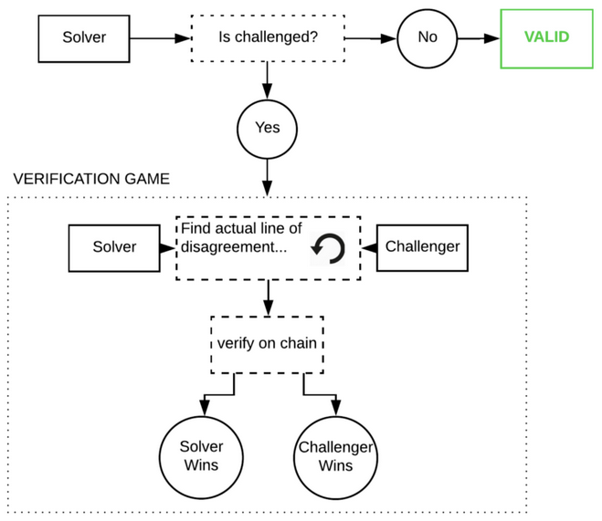
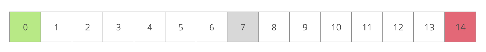
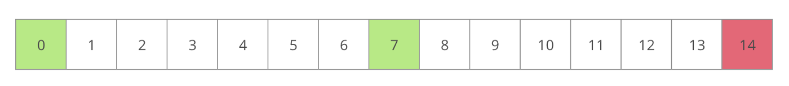
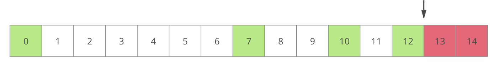
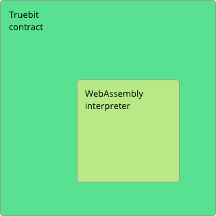

I had a chance to come across the project that could potentially revolutionise the cloud computing.
Unfortunately, sometimes great ideas do not always get to see the world at their full capacity.
This article summarises my personal findings why the Truebit did not make its way to blockchain world.

## Intro

While this article will primarily focus on technical aspects of the protocol, this is never the only side of any blockchain project.
I want to thank other people who I worked with on researching this protocol and did excellent job at looking into different aspects of it.
I will include the full list of everyone involved in this research at the end of the article with their contacts.

### Protocol summary

To understand the purpose of Truebit, it is first important to understand the problem it is trying to solve.
The whitepaper was released in 2017, just 2 years after the release of Ethereum whitepaper. It was a time of ICOs, first Dapps and horrendous gas fees. *You get the feeling where we are going with this*.

At the time, Layer 2 solutions were non-existent and developers had to face the problem of scalability and affordability of layer 1 solutions. Even though ethereum runtime is very computationally demanding, the computational output is comparable to a cheap smart phone.

That's where Truebit came in:

> TrueBit allows users on any Blockchain to securely run large computations off chain, saving compute resources and money.

To put in other words, Truebit describes a potential cloud solution that would provide a pool of computational resources allowing to run blockchain-agnostic computations in secure and trustless manner while reducing costs.

## The idea

The system involves *3 main actors*:
* **Task Giver** - an on-chain actors submitting arbitrary computation task to the system
* **Task Solver** - an off-chain worker who performs a computation and publishes the result
* **Task Verifier/Challenger** - an off-chain worker who checks the solution of task giver and/or challenges it
* **Judges** - on-chain workers (i.e. miners) who verify the computational step

Here is the overview of the process:
1. When the problem is published, the timeout is specified for its completion. Randomly selected solver have to bid with `minDeposit` until `timeOut` Only one solver can be selected. If no solvers is selected, the task is returned to the publisher.

2. If the solver doesn’t manage to complete the computation on time, the task is return back to the task giver. 

3. When the solver picks up a problem and publishes the solution, the verifier only has a specific time slot to challenge the solution. If this does not happen, the result of the computation is submitted to the caller.

4. However, if the challenger opens a dispute, both challenger and solver have limited time to respond to each other. If one does not manage to respond, the process result in the dispute loss of the non-responding party.

5. In conclusion, it is fair to say that if there is no work submitted to the chain, then all participant operate without any activity. Once the job is published, the chain tries to ensure the liveness of a operation and termination of the verification round.

Here is the overview:


The process of challenging the solution is the core elements of the protocol and described as *Challenge Game*.
The main goal for verifier/challenger in a game is to find an original computational step (i.e. the instructions) when the computation was carried out was done incorrectly.

### Game

Once the solution is published, verifiers check the result by computing the task locally.

If the challenger computed result is different from the submitted one, it submits a challenge. The dispute game begins. The challenger must also submit a deposit in order to have skin in the game.

Suppose there are `n` configurations in the solution (i.e. `n` states)

Both the verifier and then challenger computes the configuration of individual computational steps with the state snapshots. The challenger the compares his state to the solver’s state. 

These snapshots are represented as[ Merkle Tree](https://en.wikipedia.org/wiki/Merkle_tree) co-paths.

The snapshots are compared in the form of the Merkel tree which are derived from the stacks, the memory, and the entire state of the Solver’s WebAssembly virtual machine. Once, the solver submits its hash for the specific step (i.e. the leaf).

Both challenger and solver start at first computation step (i.e. `0` )

The challenger submits index `i` of the step that differs from its own and then submit it to the network. If `i` is outside the boundaries ( `i < 1 || i > (n-1)`), the challenger loses the game and deposit immediately. 

Otherwise, the challenger selects the configuration to challenge at position between the first (step `0`) and the first indicated wrong computation at `i`.

The solver submit the hash of the computation (or state snapshot) and submits it as a proof of the correctness of the solution. The challenger then computes its own merkle tree and compares the value with its own.

If they are correct, the challenger advances and selects the configuration indexed between `i  - index_of_first_incorrect_configuration` and `i`

The game eventually runs for `O(log(n))` steps and converges to the first (initial) disputed **step**.

The configuration is then submitted back to the calling blockchain where validators of the network (e.g. Ethereum nodes) can verify it quickly on-chain.

To give you an illustration:

Suppose the submitted program has 14 instructions, and verifier disagrees with the result (i.e. with the final state).


As a matter of fact, both verifier and solver have the same initial state at instruction `0`.
The verifier now becomes a challenger and submits an index of state to challenge between the initial state and the disagreed state. Suppose it is somewhere in the middle:


The Solver calculates a hash of their state. This is a Merkle Root derived from the stacks, the memory, and the entire state of the Solver’s WebAssembly virtual machine. The Solver submits this root to the contract in a Respond message.

The Challenger now computes their own state Merkle Root locally and compares with the value provided by the Solver.

If the two values are the same, they deduce that the disagreement occurred in the second half of the computation. If the two values are different, they deduce that the disagreement occurred in the first half.



This process repeats until the verifier find the first disagreed intermediate state root which indicates the incorrect state transition performed by the solver.



This disputes instruction can now be submitted to judges on chain and verified quickly.

## Implementation

The protocol relies on the **Layer 1** solution that can correctly perform small computation tasks in order to verify the correctness of the computations. The paper gives Ethereum as an example.

The TrueBit entry interface is intended to be agnostic. However, Ethereum contract is often given as an example. 

TrueBit provides the TrueBit Virtual Machine (**TVM**) which is essentially WebAssembly virtual machine. It performs the computation by the pool of participants who have the TrueBit client installed.

The TVM is consisted of two parts:

1. Off-chain interpreter which enumerates a list of states for a given computation
2. On-chain stepper which, given a state, can compute the next state.



The computation tasks can be stored either on IPFS or blockchain directly. 

## Technical problems

However, the **storage** still remains an open problem for the project. Storing data on blockchain is way too expensive whereas IPFS can not guarantee the persistency of data without an incentive.

There can be edge cases where the callers publish a tasks without making the program to compute available. Then the solver’s resources will be wasted in looking for data. This has even more severe implication on consensus, the solver can publish some arbitrary solution, but verifiers will not have any data (i.e. program) to check against resulting in incorrect solution being committed to blockchain. The project leaders have been considering multiple solutions for data persistency. The current two are

- Storing data directly on blockchain → very **expensive** but **persistent**
- Storing data on IPFS →  **cheap** but **not persistent**

The reason why storing data on IPFS is not persistent is because the protocol does not provide any incentive for it. The founders look towards Filecoin as a potential solution, but it doesn’t work well with TrueBit as it would require complex economic and protocol interoperability. Both protocol have different native tokens and operate on different networks. This would require a bridge for intercommunication between chains. The potential solution is to implement TrueBit protocol as a parachain. This would allow Truebit to utilize interoperability with other chains that provide storage solutions without any bridging.

My another proposal would be to add another layer, Storage Layer, which would incentivize participants in the network to store and propagate program’s data on IPFS, hence ensuring the persistency and availability of data for the duration of the execution of the program.

Another potential room for improvement would the ecosystem, the app stack limits the scalability of the technology in a way that there are not enough resources for developers to build solutions. It doesn’t have a published the generic smart contract on Ethereum blockchain which would allow to easily call it form other contracts and supply tasks for computation.

## Economic incentive

### Fixed Pricing (Regulation)

In Truebit verifiers choose their own tasks, and ample rewards must be provided to ensure that at least one verifier chooses each task. The non-negotiable requirement of at least one verifier per task keeps Truebit from using price discovery in an open market structure. If task givers got to choose their own fee rates, tasks bearing particularly low rewards would fail attract the solvers and verifiers needed to achieve finality. TrueBit’s reliance on a large solver pool is not thoroughly explored in the white paper because it impacts throughput more than the security of the network. But a healthy solver pool is also supported by higher computation fees.

In *section 4.2* the white paper states that, 

> “in practice the verification tax requires a substantial cushion. We estimate the necessary verification tax to be **500% – 5000%** of the cost of performing the given task.”
> 

High fees relative to the computing price are undesirable, but they are still far lower than the gas fees Ethereum would charge for an equivalent computation on chain. This is analogous to benevolent price fixing in TrueBit’s governance system.

### Real time response

Unlike many historical examples of price fixing, TrueBit prices could still implement a measure of real time responsiveness to supply and demand. Instead of voting on a singular price per computation unit, participants would vote on a pricing function `f` so that.

```
f(V,S) = T
```

Where 
 - `V` = the average number of verifiers per task on the network
 - `S` = the proportion of solver computation speed to task volume (throughput/demand)
 - `T` = the tax or fee rate relative to the price of cpu cycles for the underlying computation

Such a function could be piecewise defined so that fees required of task givers increase dramatically when average verifiers per task fall dangerously low. Likewise when solver throughput falls uselessly low. The responsiveness price functions provide vs fixed prices should mitigate much of the market inefficiency caused by a lack of true price discovery. This pricing function based approach wasn’t explicitly mentioned in the TrueBit white paper, so I propose it as an improvement.

## Incentivising Good Behavior

### Task Giver Incentives

The task giver has a need for trustless computation taking inputs from a blockchain and feeding outputs back to that chain. They could perform their computations on chain, but slow or expensive chains make this impractical for sufficiently heavy tasks. TrueBit proposes to offer a lower price and faster speed for the same good, trustless computation. This ought to draw task givers willing to pay the associated fees to have their tasks done.

### Task Solver Incentives

Solvers are incentivized in two ways to participate in a non Byzantine fashion. Firstly they are required to maintain a deposit which will be forfeited when the solver submits incorrect computation and loses a round of the verification game with a verifier. The required size of this deposit is dictated by the task giver. Secondly, they are paid out rewards proportional to the cpu cycles required by the tasks they complete. A non Byzantine solver can therefore expect to be rewarded with at least enough payout to cover their costs. Tuning the solver payout value can allow TrueBit to be competitive in bidding for solver computational resources against all other potential bidders.

### Task Verifier Incentives

To ensure verifiers don’t waste verification game resources, verifiers are also required to maintain a deposit to be forfeited if they lose a round of the verification game. Rewarding verifiers is more complicated. They can’t be rewarded in cases where they don’t challenge the solver’s result. That’s because without running the resource intensive verification game, judges don’t know whether verifiers checked any part of the computation at all. Thus false verifiers could be rewarded without doing any real work. TrueBit instead uses a bug bounty, where verifiers are only rewarded for going through a round of the verification game with a solver and proving the solver is in error. 

To ensure that verifiers have consistent reason to participate TrueBit generates forced errors, asking the solver to intentionally give a false computation. Solvers aren’t punished for these forced errors, and verifiers win a jackpot reward for spotting them. The rewards for finding real errors are to be made intentionally small compared to those for finding forced errors. This is both to remove volatility from the rewards verifiers receive and to prevent the treasury from being depleted in the case of many consecutive successfully challenged errors.

### Gaming Payouts

For the purpose of gaming payouts it is reasonable to consider pairwise sibyl attacks as done in the TrueBit white paper. When adding many more sibyl identities of the same kinds the attack becomes at best an expensive takeover analogous to a 51% attack. Such an expensive attack is unlikely to result in monetary gain unless targeting a particular massive payout dependent on the outcome of a particular TrueBit calculation. 

Judges and solvers: A judge can’t work to give the solver a particular task. That’s because the random bits determining solver assignment come from the hard process of mining valid blocks done by the judge. A judge can’t mine arbitrarily many blocks to get the right one for the solver. They can only discard blocks with random bits causing a forced error jackpot, but that doesn’t cause an incorrect payout to any party.

Solvers and task givers: Solvers are assigned tasks using random bits the task givers don’t know at the time of task creation. Therefore intentionally creating a task which when combined with the solver’s random bits results in a forced error isn’t possible. Solvers and task givers can’t even produce correct solutions without work together consistently since solvers are assigned tasks randomly.

Solvers and verifiers: Winning the verification game only results in gaining about half the losing party’s deposit. Thus a single entity acting as both solver and verifier can only lose money by challenging itself. The solver can gain extra income by challenging their own forced errors, but one such challenge per forced error doesn’t jeopardize the system. Jackpot totals are purposefully reduced per verifier finding the jackpot such that a solver acting as several verifiers cannot mass challenge the jackpot to hoard a greater share. 

Task giver and verifier: It is desired that task givers would want to verify the results for their task. The task giver doesn’t have information to pass the verifier which would allow undue access to jackpot funds. The next best outcome for this sibyl pair is to perform their role correctly.

### Economic summary and problems

TrueBit’s economics could be improved by VRF enabled forced assignment of verifiers to tasks. Because the proposed structure for TrueBit allows verifiers to pick their own tasks, a very large pool of verifiers and much greater task fees of 500-5000% are needed to ensure at least one verifier picks each task. This overhead could be substantially reduced by centrally assigning verifiers to tasks, ensuring that some minimum safety threshold is met by requiring for example three verifiers per task. This system could cut the required verifier pool by more than half, reducing fees equivalently. Using this system verifiers and solvers could even be grouped together into a simpler worker pool from which jobs are randomly assigned. This would guarantee that there is never a critical imbalance between numbers of solvers and verifiers.

A possible attack scenario can be constructed by registering multiple verifiers, which is possible because Truebit is not Sybil-proof. The idea is to decrease the economic incentives for honest verifiers to participate in the protocol by diluting the reward pool for the verifiers. This, of course, only possible if the attacker is willing to incur a loss with his own verifications. Once one verifier node of the attacker has found a wrong computation, it will broadcast it to all other attacker verifiers which all start a dispute. The reward for finding a fraudulent computation is divided by the number of verifiers that report it, and additionally the total reward is decreased with more verifiers reporting it. Using this mechanism, we are able to decrease the reward for honest verifiers and eventually drive them out of the protocol since they are running a loss on participating. 
As an example, if we run 99 verifier nodes and one finds a fraudulent computation, which one other honest verifier also reports, the attacker will get 99% of the reward for running one actual computation, while the honest node will only receive 1% for the same amount of work. Since the total amount is decreased, it is likely that the attacker will still incur a loss, which is the cost of taking over the network. Once honest verifiers are driven out of the protocol, the attacker could register solvers and submit erroneous answers to computational tasks. Those errors would go uncaught as only Byzantine verifiers remain. Thus a sufficiently well resourced attacker can completely hijack the protocol.

Since the Truebit protocol is likely much smaller than the networks its client are hosted on (e.g. ETH), it can be the weakest part of its clients security and thus compromise their security. If a protocol on ETH relies on Truebit for computations, it decreases its own security to that of Truebit. The is a major issue, since taking over Truebit according to attacks like the one pointed out in a) is much less costly than performing attacks on ETH. From a security perspective, using Truebit only makes sense for clients with a weaker security than Truebit.


## Conclusion

Even though the idea was truly promising, the actual implementation lacked attention to critical technical and economic details.
It seems like the problem also lied in the governance of the protocol which basically followed a dictator model. The founder never incentivised community to work on protocol and kept the system *black-boxed* for a long time.

The only mentioning of governance related processes is that “the user community can democratically update the interpreter as needed”, which lacks any specification and is not further elaborated in the paper. Since no propositions about decentralized/community governance or democratic voting processes are put forward by the developer team, it is reasonable to assume that the team intends to control the projects as a centralized company.

However, things did not get unnoticed with Truebit. It paved the way for one-step proof and Layer 2 protocols like ArbitrumOne. I personally enjoyed reading their whitepaper and truly believed in the idea they were trying to implement. Maybe one day we will see truly decentralised trustless cloud solutions allowing to utilise the full potential of combined computational resources in the network.

We just need to keep trying.

## Extra - Proof of Computation

***Take this section with a pinch of salt. These thoughts are our pure ideas that may or may not have any theoretical backup.***

The idea behind TrueBit can path the way for the new consensus mechanism: **Proof of Computation**. 

Current cloud solutions are centralized and essentially make users to put trust into them. Additionally, the most popular blockchains use PoW consensus as a way to select a block author while wasting a lot of energy.

Our solution tackles both problems by providing using the computation as a proof for the right to mine the block. The protocol will take some arbitrary computational tasks and gossip them to the network. The node that is proven to have the right computation first, wins a chance. The correctness of the solution is insured through the dispute game used in the TrueBit protocol.

The problem we are trying to solve is how to decentralize cloud computing through a process called proof of computation. The concept behind proof of computation is to capitalize on existing functions within the blockchain ecosystem which are currently ignored. PoW systems output a large amount of computational power, but do not result in an efficient output of computational work. Proof of computation attempt to more effectively use this processing power by incentivizing the user to focus more on useful data processing using the TrueBit protocol with existing blockchain hardware.

## Credits

Many thanks to [Timo Neumann](https://www.linkedin.com/in/timo-neumann-a0438b217/), [Bradley Olson](https://www.linkedin.com/in/bradley-olson-a62023114/), [Matteo Perona](https://www.linkedin.com/in/matteo-perona/) and André Sequest who did amazing work on researching governance, economics, cryptography and threat models of this protocol.

**Sources**
- [Truebit whitepaper](https://people.cs.uchicago.edu/~teutsch/papers/truebit.pdf)
- [Medium](https://medium.com/truebit/truebit-the-marketplace-for-verifiable-computation-f51d1726798f)
- [Truebit github repos](https://github.com/TruebitProtocol/)

---

If you have some feedback, comments or questions, I would love to hear them. You can start a [discussion](https://github.com/SkymanOne/SkymanOne.github.io/discussions) on github or [email me](mailto:german.nikolishin@gmail.com).
