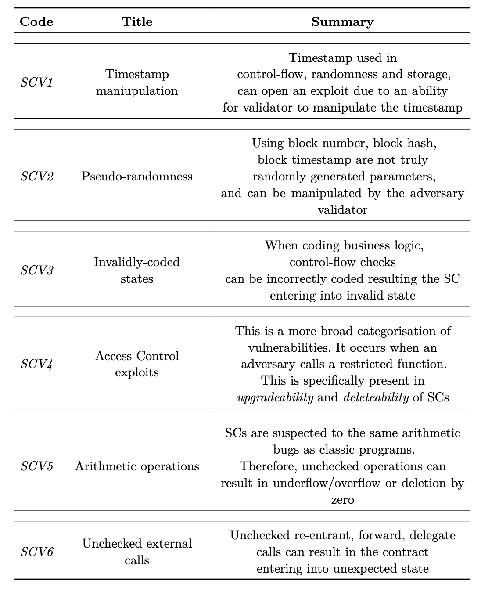

This article presents a short extract from my BSc final year thesis 
which focuses on the exploration and development of the smart contract language
with intrinsic _functional safety_ and _liveness_ guarantees, _Folidity_. 
This properties enable the compiler to formally verify a typical program in Folidity
at the compile time. In this post, we explore some of the constructions of the compiler as
well as my personal experience writing a toy compiler in Rust.


# Intro


I had to choose a topic for my final year project of my BSc Computer Science degree, there were a lot of options on the table ranging from provable security to a simple DEX web application to swap some tokens around. I needed to choose something of necessary complexity, but also something achievable in the span of 6 months. I was working at Parity at the time in the [ink!](https://use.ink) team, a smart contract eDSL in rust for substrate-based blockchains. While working there, security and safety of smart contract was a frequent topic of discussion within our team and the developer community.

Therefore, an idea came across my mind: what if there would be a smart contract language designed in such a way that we can prove certain safety properties from program's syntax at the compile? That's how I came with the idea of _Folidity_ - formally-verifiable smart contract language.  
It is not hard to guess where the name originates from, and a friend of mine kindly shared a perfect mascot for the language as well:


As mentioned earlier, in this post, I would like to share my formal reasoning for developing such a language, and the experience of writing a very simple compiler in Rust.

# Security and Safety of Smart Contracts

## Overview

With the increased adoption of DApps and the total value locked in them, 
numerous attacks have focused on extracting funds from SCs. 
Due to SCs' permissionless nature, the most common attack vector exploits mistakes in the SC's source code.
Specifically, the attacker can not tamper with the protocol code due to consensus mechanisms.
Instead, they can interact with the publicly accessible parameters and interfaces to force the SC into an unexpected state, essentially gaining partial control of it.

A notorious example is the DAO hack, when hackers exploited unprotected re-entrance calls to withdraw *$50 million worth of ETH*. 
This event forced the community to hard-fork the protocol to revert the transaction, provoking a debate on the soundness of the action .

Another less-known example is the "King of the Ether" attack, caused by the unchecked low-level Solidity `send` call to transfer funds to a contract-based wallet .
The "King of the Ether Throne" contract could not recognise the failed transaction on the wallet side. Instead, the contract proceeded with the operation, incorrectly mutating its internal state. 

Other issues involve the _safety_ and _liveness_ of SCs. 
The term _safety_ describes _functional safety_ and _type safety_. _Functional safety_ refers to the guarantees that the system behaves according to the specification irrespective of the input data ,
whereas _type safety_ refers to the guarantees that the language provides a sound type system .
The two are often used interchangeably with the _security_ of code
as compromising the former affects the latter. When discussing _liveness_, we describe the business logic of a DApp, particularly whether it transitions into the expected new state .
This is particularly important for executing mission-critical software in a distributed context.

_Safety_ and _liveness_ can be compromised due to the programmer's mistakes in the source code that can result in the SC entering the terminal in an unexpected state
preventing users from interacting with it .


## Vulnerability Classification

There has been an effort in both academia and industry to classify common vulnerabilities 
and exploits in SCs in blockchain systems   . 
Some of the work has been recycled by bug bounty platforms, growing the community of auditors
and encouraging peer-review of SCs through the websites such as [_Code4rena_](https://code4rena.com), [_Solodit_](https://solodit.xyz),
and many others.



Analysing the abovementioned work, SC vulnerabilities can be categorised into the six general groups in the table below.
The six categories have been defined based on an analysis of the most common vulnerabilities and how they affect SC execution. 
Each category represents the general scope for a specific set of vulnerabilities that should be addressed in the SC development.

Even with the raised awareness for the security and safety of SCs, recent reports from _Code4rena_ still show *SCV(3)*, *SCV(4)* and *SCV(5)*.
commonly present in the recent audit reports   .

In particular, as  shows, a relatively simple calculation mistake prevented other SC users from withdrawing their funds.

It can be seen that SC Vulnerabilities illustrated in the table are still evident in modern SCs, resulting in opening them up to exploits of different severity levels.
Looking at the mentioned reports, there is little consensus about the weight of each vulnerability.
Therefore, we can not classify any particular vulnerability as more severe than the other as it solely depends on the context in the code it is present.
Furthermore, it has been realised that additional tooling or alternative SCLs need to be discovered to minimise the exposure of SC code to the earlier-mentioned vulnerabilities.

# Related work

We can generally categorise related work to formal verification tools that are used alongside existing codebase, and the safe smart contract languages that provide intrinsic safety guarantees.

Formal verification describes the assessment of the correctness of a system concerning a formal specification . 
The specification is usually described
in terms of verifiable models using mathematical proofs. There are multiple ways to verify a program formally focused on specific parts. _Model checking_ utilises propositional logic 
to verify the mathematical abstractions of the system . _Theorem proving_ involves verifying
relations between the model and the statements about the system . Finally, _symbolic execution_ focuses
on executing the program using symbolic values instead of concrete values .

[KEVM](https://jellopaper.org/index.html) is a tool that provides executable semantics of EVM using _K_ framework. 
It uses reachability logic to reason symbolically about the system.
Specifically, SC developers are required to write a specification in a separate file that is checked against the SC's compiled EVM bytecode.
Whilst this provides more fine-grained assurance of the safety and correctness, it requires specialised knowledge of the $KK$ framework and EVM
semantics, hence significantly increasing the development time.

The other interesting tool is [Dafny](https://dafny.org/latest/DafnyRef/DafnyRef). Dafny is a general-purpose tool that checks inputs in any language 
using Hoare-logic and high-level annotations. Although Dafny offers compilation to some system languages, Solidity is not yet a supported target. 
The syntax resembles a traditional imperative style and is substantially easier to learn and understand than KEVM.

Some tools can be used alongside Solidity code, such as [Scribble](https://docs.scribble.codes). 
Scribble enables developers to provide formal specifications of functions inside docstrings that seamlessly integrate with existing Solidity code. 
It offers VS Code extensions and is actively maintained by [Consensys](https://consensys.io/diligence/scribble). 
The trade-off is the limited expressiveness compared with KEVM and Dafny.


Overall, we can see that formal verification tools provide a robust way of ensuring the safety of SCs. 
While significant effort has been made in the field, it is evident that formal verification tools in SC development
attempt to compensate for Solidity's implicit state transitions and lack of _implicit_ safety.

On the other hand, there are languages that offer alternative reasoning about the program, which allows to prove certain safety properties at the compile time.


Flint is an experimental language with protected calls and asset types . Protected calls introduce a role-based access system
where the SC developer can specify the permitted caller to a message function. Another unique feature is array-bounded loops
that partially address the halting problem. Flint also addresses a state-transition problem by allowing developers to specify
all possible states in the contract. The message functions need to specify the state transition, which occurs explicitly.
The language provides a significant improvement in a modelling approach. However, it still lacks the modelling SC input data in terms
of constraints and invariants, and explicit state transition is still an optional feature that the developer can miss in using.

Another promising SCL reasons about SC development through dependent and polymorphic types . It extends [Idris](https://www.idris-lang.org). 
and makes the developer model the SC as part of a state transition function by adopting a functional programming style. Dependent types provide more
fine-grained control over the input and output data that flow through the SC functions. In particular, similar to Haskell, the language offers _side-effects_ 
functionality that resembles _IO_ monads in Haskell. The downside of the approach is that the syntax has become too cumbersome for other developers to learn. Thus,
it has been stated that the language does not strive for simplicity and sacrifices it for safety.


At the time of writing, Nethermind has released a unique framework for unifying arbitrary program written in Solidity, [Clear](https://medium.com/nethermind-eth/clear-prove-anything-about-your-solidity-smart-contracts-04c6c7381402). The framework offers a theorem a set of theorems written in [Lean](https://lean-lang.org/), theorem-prover DSL. Clear translates Solidity code into Yul lower level language using `solc` compiler. The artifacts are then translated to Lean artifacts which are then verified against pre-defined theorems. This enables developers to prove functional correctness of their Solidity code against pre-defined theorems without the need to build additional specification.

## Problem statement

We can identify the positive trend in providing safety for SCs.
Modern formal verification methods offer support to SC developers in ensuring that their code satisfies the requirements of the system, while
proposed SCL solutions offer runtime safety, minimising the need for the former.

However, there has been no effort to combine the two approaches into a single development process. Formal verification tools
focus on the validation of functional correctness and model consistency of a program at the compile time, whereas SCLs focus on data validation 
at the runtime. Recent work suggests that the improved optimisation of SMT solvers allows us to turn the formal model specification into 
the runtime assertions . Furthermore, no effort has been made to minimise false negatives in SC formal modelling, 
even though the methods have been developed for traditional systems, such as Event-B .

In light of the above, we believe there is a need for a solution that combines two approaches to allow SC developers to reason
about their program in terms of FSM models that can be verified at the compile time for functional correctness and model consistency,
and enable an automatic generation of invariants and constraints to validate the data at runtime.

We propose _Folidity_, a safe smart contract language. Folidity offers a model-first approach to development
while featuring a functional-friendly programming style. The language intends to offer a safe and secure-by-design approach to the programming, 
ensuring the developer is aware of any state transitions during execution.

The list of feature requirements has been comprised based on the vulnerabilities described earlier.


1. **Provide abstraction over timestamp**: We are interested in the limited use of timestamps in SCs in favour of the block number or another safe primitive.
2. **Provide a safe interface for randomness**: Folidity should also provide a source of randomness through a standardised interface.
3. **Enable model-first approach in development**: Developers should reason about the storage in terms of models and how they are updated by events. This approach is inspired by the Event-B @event_b work, which can also be applied to SC development.
4. **Explicit state checks at runtime**: SC developers should be aware of any state transitions that update the state of the model. State transitions must happen explicitly and be validated at the runtime to guarantee _liveness_.
5. **Static typing**
6. **Polymorphic-dependent types**: Polymorphic-dependent types should be part of a runtime assertion check during state transition, and model mutation.
7. **Role-based access**: All message functions that mutate the model should be annotated with the role-access header specifying which set of accounts is allowed to call it.
8. **Checked arithmetic operations**: All arithmetic operations should be checked by default, and the developer is responsible for explicitly specifying the behaviour during over/underflow, similar to Rust.
9. **Enforced checked recursion or bounded loops**
Infinite loops should not be permitted, and any loops should generally be discouraged in favour of recursion. The recursion base case should be specified explicitly with appropriate invariants.
Bounded loops may be used but should be limited to list or mapping iterations.

Formal verification is a novel addition to the workflow.
After verifying the model consistency, invariants, and constraints, the program is considered safe for generating runtime assertions.

# Language design

Folidity features a rich grammar that abstracts away from low-level operations while providing a high level of readability and expressivity.

Folidity is described using [LR(1)](https://en.wikipedia.org/wiki/LR_parser) grammar as outlined in @Appendix:Grammar[Appendix].
One of the advantages of using LR(1) grammar is its expressiveness and clarity, which allow it to describe sophisticated data structures. 
It additionally enables easier implementation of the error-recovery  for reporting purposes, which lies at the core of the compiler.

## Primitives, Expressions and Statements

Starting from primitives, Folidity provides numerous data types allowing encoding data for the domain of use cases in dApps: 
- `int`, `uint`, `float` - signed, unsigned integers and floating-point numbers
- `()` - unit type, similar to rust this means no data.
- `string` - string literals, can be provided as `s"Hello World"`
- `hex` - hexadecimal string literals, provided as `h"AB"`
- `address` - account number literal, provided as `a"<address>"`
- `list<a>`, `set<a>` - lists of elements of type `a`, `set` describes a list of unique elements.
- `mapping<a -> b>` - a mapping from type `a` to type `b` using the relation `->`
  - `->` : total relation 
  - `-/>` : partial relation, can be combined with injective and surjective notations.
  - `>->` : (partial) injective relation
  - `->>` : (partial) surjective relation
  - `>->>` : bijective relation 
- `char` - character, provided as `'a'`
- `bool` - boolean literals `true` or `false`

By describing the type of relations in mappings, we can combine the Event-B approach of proof obligation with symbolic execution to provide strong formal guarantees of member inclusion and member relations.

Specifically, we can define some axiom where we can have a mapping of partial injective relation between addresses (`address`) and asset ids (`uint`) `assets: mapping<address >-/> int>`:

$$ Assets: Address \rightharpoonup Int $$

Then, for some statement $$S$$: `assets = assets :> add(<a>, <b>)`, we can treat as a hypothesis. The compiler can then assert:
$$ S, (a', a \in Address) \vdash Assets(a) \neq Assets(a') $$

Looking at the expressions, Folidity provides a standard set of operators to describe mathematical and boolean expressions (e.g. `+`, `/`, `||`, etc.)
with few additions.
- `in` - inclusion operator, return `true` if for `a in A`, the $a in A$ is true, if used in boolean context. Otherwise, it extracts an element from `A` and assigns it to `a` when used in iterators.
- `:>` - pipeline operator, heavily inspired by [F\# `|>` operator](https://learn.microsoft.com/en-gb/dotnet/fsharp/language-reference/functions/#pipelines). It allows piping the result of one function into the other one. This enables easy integration of a functional style of programming and handling of side effects of the mathematical operations, such as overflow or division by zero.
```rust
let result: int = a + 1_000_000_000 :> handle((_) -> return 0);
```

Statements have close resemblances to Rust syntax, e.g.
```rust
let <var_ident>: <optional_type> = <expr>; 
```

The type can be derived at the compile time from the expression.

It is worth looking at the unique additions such as struct instantiation and state transition.

Any structure-like type can instantiated using the \ `<ident> : { <args>, ..<object> }` syntax, where
- `<ident>` - Identifier of the declaration.
- `<args>` - list of arguments to assign fields
- `<object>` - Object to fill the rest of the fields from if not all arguments are provided. 

This expression can be combined with the state transition statement to execute the explicit change in the internal state of the SC.

```
move <state_ident> : { <args>, ..<object> };
```

### Declarations

A typical program in Folidity consists of data structures that describe models, states, and functions that can interact with each other. Models are one of the core structures that provide the model consistency guarantee in Folidity. States can encapsulate different or the same models and describe explicit state transition or state mutations as part of program execution, and functions are the driving points in program execution. Functions declare and describe the state transitions.

Models resemble regular `struct` structures in "C-like" languages with
few differences.

They describe some representation of the storage layout that is encapsulated within explicit states.

```
model MyModel {
    a: int,
    b: string,
} st [
    a > 10,
    b == s"Hello World"
]
```

Folidity enables developers to further constrain the data that the model can accept by specifying model bounds in `st` #footnote("States for \"such that\"") blocks. This syntax can also be used in state and function declarations as illustrated later.
To support context transformation, any global state variables (e.g. block number, current caller) are injected into a model as fields and can be accessed in `st` blocks and expressions in functions.
Furthermore, Folidity borrows the idea of model refinements from Event-B by allowing a model to inherit another model's fields and refine its constraints.


```
model ParentModel {
    a: int,
    } st [
     a > 10,
]

model MyModel: ParentModel {} st [
    a > 100
]
```


States facilitate the tracked mutation of the storage. They can encapsulate models, have raw fields in the body, or not contain any data at all.
They are essentially _the_ data structures that get encoded and stored as raw bytes in the contract storage.

```
model ParentModel {
    a: int,
} st [
    a > 10,
]

state StateA(ParentModel) st [
    a < 100
]

state StateB {
    b: uint
} st [
    b < 10
]

state NoState
```
The idea behind model encapsulation is to enable distinct states to represent identical models with their distinct constraints.
Additionally, states' bounds can be further restricted by specifying the incoming state, which is the only state from which we can transition to the specified state.

```
state StateA from (StateB s) st [
    s.a > 10
]
```

As mentioned earlier, functions facilitate the model mutation of the Folidiy SC. Functions provide a controlled interface for the user and other contracts to interact with the state of the application. Therefore, it is important to enable developers to control the execution flow of the incoming data and provide them with fine-grained control over output data and storage mutation.

Let's look at the signature of a typical function in Folidity;

```
@init
@(any)
fn (out: int) my_func(input: hex) 
where (InitialState s1) -> (FinalState s2)
st [
    input != h"ABC",
    out > 10,
    out < 100
    s1.a == s2.a
] { <statements> }
```

Starting from the top: `@init` is an optional attribute that indicates the function is used for instantiation of the contract.
A developer can specify who can call the contract by using the `@(any)`. `any` is a wildcard variable indicating that anyone can call it.
However, it is possible to specify a list of addresses or a specific address using data from the incoming state `@(s1.whitelist | a"<some_address>")`.

If no attributes are specified, then it is assumed that the function is private and internal.

Moving on, `(out: int)` is a return type bound by the variable `out` that can be used to specify a post-execution condition to ensure that the function's output is within the specification. It is also possible to just specify the return type, `fn int my_func(...)`. The `my_func` is an identifier of the function, followed by the list of typed parameters.

Functions in Folidity feature `where` blocks enable developers to specify state transition bounds and are also used to inject the current state into the function's execution context. Certain functions can only be executed if the input state matches the current state. After `->` we have a final state that indicates which state we transition to, this can be the same state, meaning that the function only mutates the current state and doesn't logically advance. Both input and output states can be bound by variables
to specify pre and post-mutation constraints. Notice that states' variables are declared differently from other data types. This is a conscious design decision to differentiate the state mutation parts from the traditional manipulation of primitive data.

Additionally, Folidity offers a unique type of function: _view functions_. They are used exclusively for enquiring about current or previous state variables and are explicitly restricted from modifying the state of the contract.

```
view(BeginState s) fn list<address> get_voters() {
    return s.voters;
}
```

These functions are prefixed with the `view(StateName v)` tokens that indicate what state the function accesses. They do not require any attributes since they are public by default and can not be used for instantiation. 

Finally, Folidity offers `struct` and `enum` declarations resembling the ones in Rust. They can be used as a type in the variable or field type annotations.

## Formal verification

Folidity's grammar is structured with first-class support for formal verification in mind. Therefore, the compiler can imply and prove certain mathematical and functional properties of the program directly from the code without the need to perform any context translations, as in the aforementioned solutions. 

### Model consistency

As an example of the theory behind model consistency in SCs, let's look at role-based access. Suppose:

- \* $$ = \{ \text{All addresses} \}$$
- _M_ $$ = \{ \text{Moderators of the system} \}$$
- _A_ $$ = \{ \text{Admins of the system} \}$$

Then, we can model a role-based access hierarchy as

$$ A \subseteq M \subseteq * $$

Subsequently, given some event for the system `add_mod(a: Address)`, we can define the following invariants for the system:

$$
i_0 := card(A) = 1 \\
i_2 := card(B) = 5 
$$

And the invariant for the event:

$$ i_2 := c \in A $$

Where
- $$c$$ - caller's address

- $$i_n$$ - enumerated invariant with some boolean statement

- $$card(...)$$ - cardinality of a set

For the denoted event, suppose we mutate the model by adding an address to a set of admins:
$$ A: A \cup \{ a \}$$

Then, we can verify the model consistency for some state transition from an initial state $$S$$ to a new state $$S'$$, $$S \rightarrow S'$$, using propositional logic.

$$ \frac{(i_0 \land i_1 \land i_2) \rightarrow A \cup \{ a \}, a \in *, c \in A}{A \cup \{ a \}} $$

However, as it can be seen, one of the premises violates the invariant, in particular:

$$ \frac{card(A) = 1 \rightarrow A \cup \{ a \}, a in *}{A \cup \{ a \} } $$ 

In practice, the following error can be picked at the compile time by using symbolic execution of the code.
The other invariant, $$ i_2 $$, can be picked at the runtime by generating an appropriate assertion.

# Bibliography

