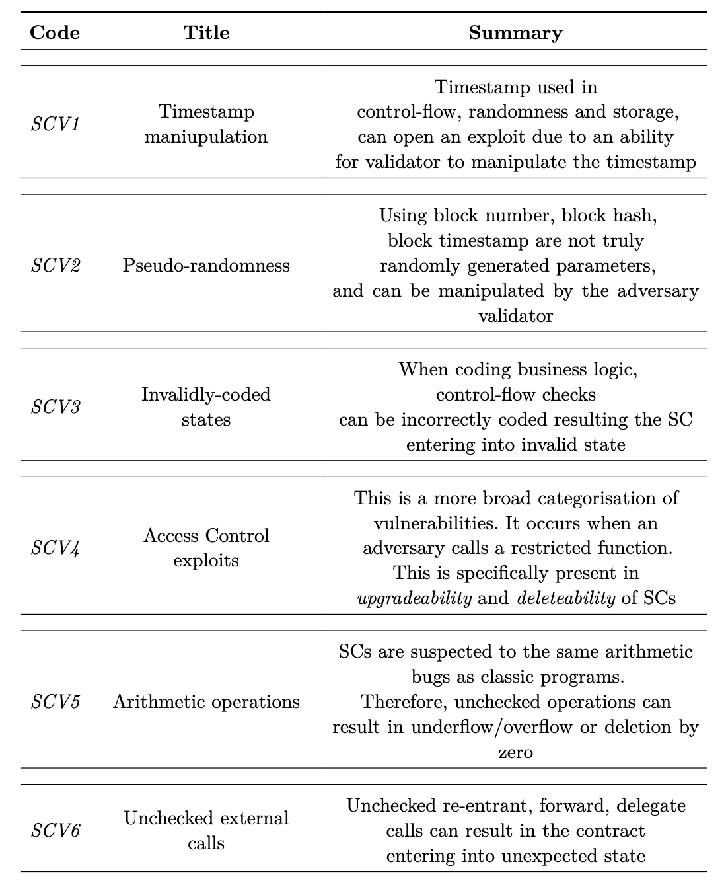
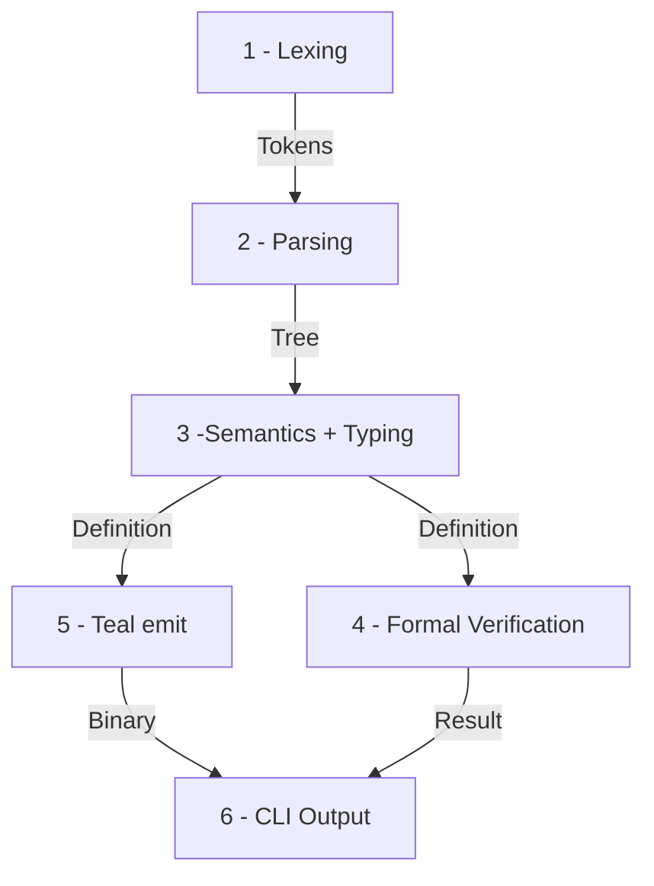
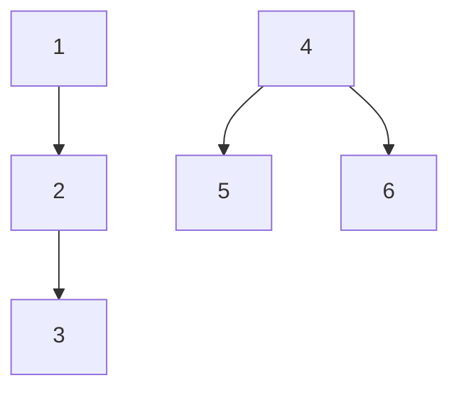
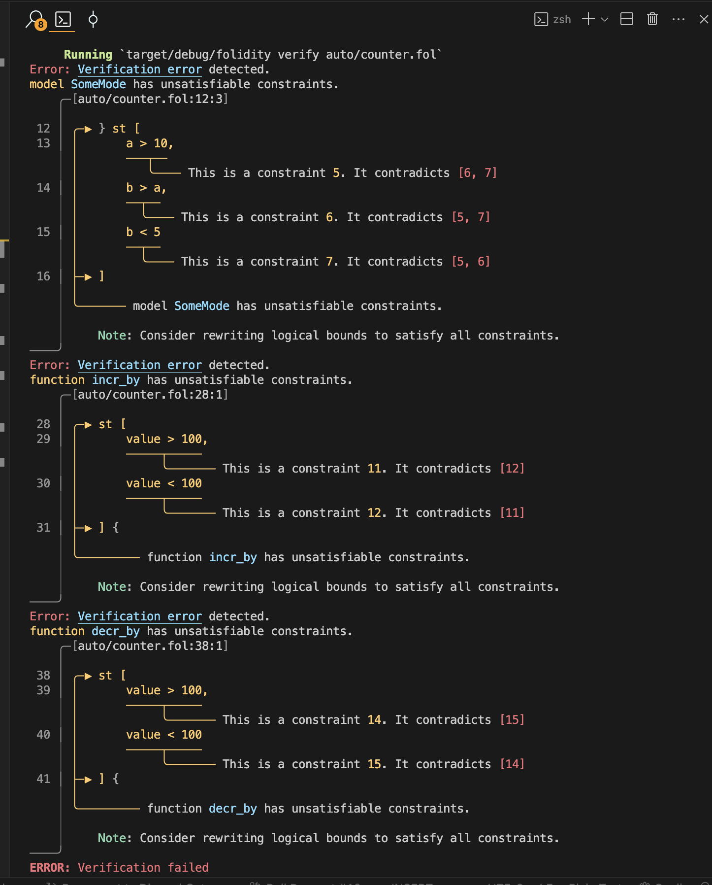

This article presents a short extract from my BSc final year thesis
which focuses on the exploration and development of the smart contract language
with intrinsic _functional safety_ and _liveness_ guarantees, _Folidity_.
This properties enable the compiler to formally verify a typical program in Folidity
at the compile time. In this post, we explore some of the constructions of the compiler as
well as my personal experience writing a toy compiler in Rust.

# Intro

I had to choose a topic for my final year project of my BSc Computer Science degree, there were a lot of options on the table ranging from provable security to a simple DEX web application to swap some tokens around. I needed to choose something of necessary complexity, but also something achievable in the span of 6 months. I was working at Parity at the time in the [ink!](https://use.ink) team, a smart contract eDSL in rust for substrate-based blockchains. While working there, security and safety of smart contract was a frequent topic of discussion within our team and the developer community.

Therefore, an idea came across my mind: what if there would be a smart contract language designed in such a way that we can prove certain safety properties from program's syntax at the compile? That's how I came with the idea of _Folidity_ - formally-verifiable smart contract language.  
It is not hard to guess where the name originates from, and a friend of mine kindly shared a perfect mascot for the language as well:


As mentioned earlier, in this post, I would like to share my formal reasoning for developing such a language, and the experience of writing a very simple compiler in Rust.

# Security and Safety of Smart Contracts

## Overview

With the increased adoption of DApps and the total value locked in them,
numerous attacks have focused on extracting funds from SCs.
Due to SCs' permissionless nature, the most common attack vector exploits mistakes in the SC's source code.
Specifically, the attacker can not tamper with the protocol code due to consensus mechanisms.
Instead, they can interact with the publicly accessible parameters and interfaces to force the SC into an unexpected state, essentially gaining partial control of it.

A notorious example is the DAO hack, when hackers exploited unprotected re-entrance calls to withdraw _$50 million worth of ETH_.
This event forced the community to hard-fork the protocol to revert the transaction, provoking a debate on the soundness of the action [^the_dao].

Another less-known example is the "King of the Ether" attack, caused by the unchecked low-level Solidity `send` call to transfer funds to a contract-based wallet [^king_of_the_ether].
The "King of the Ether Throne" contract could not recognise the failed transaction on the wallet side. Instead, the contract proceeded with the operation, incorrectly mutating its internal state.

Other issues involve the _safety_ and _liveness_ of SCs.
The term _safety_ describes _functional safety_ and _type safety_. _Functional safety_ refers to the guarantees that the system behaves according to the specification irrespective of the input data [^func_safety],
whereas _type safety_ refers to the guarantees that the language provides a sound type system [^types_pierce].
The two are often used interchangeably with the _security_ of code
as compromising the former affects the latter. When discussing _liveness_, we describe the business logic of a DApp, particularly whether it transitions into the expected new state [^liveness_rob].
This is particularly important for executing mission-critical software in a distributed context.

_Safety_ and _liveness_ can be compromised due to the programmer's mistakes in the source code that can result in the SC entering the terminal in an unexpected state
preventing users from interacting with it [^ondo_report].

## Vulnerability Classification

There has been an effort in both academia and industry to classify common vulnerabilities
and exploits in SCs in blockchain systems [^owasp] [^stefano].
Some of the work has been recycled by bug bounty platforms, growing the community of auditors
and encouraging peer-review of SCs through the websites such as [_Code4rena_](https://code4rena.com), [_Solodit_](https://solodit.xyz),
and many others.



Analysing the abovementioned work, SC vulnerabilities can be categorised into the six general groups in the table below.
The six categories have been defined based on an analysis of the most common vulnerabilities and how they affect SC execution.
Each category represents the general scope for a specific set of vulnerabilities that should be addressed in the SC development.

Even with the raised awareness for the security and safety of SCs, recent reports from _Code4rena_ still show _SCV(3)_, _SCV(4)_ and _SCV(5)_.
commonly present in the recent audit reports [^arcade_report] [^ondo_report] [^centrifuge_report].

In particular, as [^centrifuge_report] shows, a relatively simple calculation mistake prevented other SC users from withdrawing their funds.

It can be seen that SC Vulnerabilities illustrated in the table are still evident in modern SCs, resulting in opening them up to exploits of different severity levels.
Looking at the mentioned reports, there is little consensus about the weight of each vulnerability.
Therefore, we can not classify any particular vulnerability as more severe than the other as it solely depends on the context in the code it is present.
Furthermore, it has been realised that additional tooling or alternative SCLs need to be discovered to minimise the exposure of SC code to the earlier-mentioned vulnerabilities.

# Related work

We can generally categorise related work to formal verification tools that are used alongside existing codebase, and the safe smart contract languages that provide intrinsic safety guarantees.

Formal verification describes the assessment of the correctness of a system concerning a formal specification [^eth_formal_verification].
The specification is usually described
in terms of verifiable models using mathematical proofs. There are multiple ways to verify a program formally focused on specific parts. _Model checking_ utilises propositional logic
to verify the mathematical abstractions of the system [^model_checking]. _Theorem proving_ involves verifying
relations between the model and the statements about the system [^theorem_proving]. Finally, _symbolic execution_ focuses
on executing the program using symbolic values instead of concrete values [^eth_formal_verification].

[KEVM](https://jellopaper.org/index.html) is a tool that provides executable semantics of EVM using _K_ framework.
It uses reachability logic to reason symbolically about the system.
Specifically, SC developers are required to write a specification in a separate file that is checked against the SC's compiled EVM bytecode.
Whilst this provides more fine-grained assurance of the safety and correctness, it requires specialised knowledge of the $K$ framework and EVM
semantics, hence significantly increasing the development time.

The other interesting tool is [Dafny](https://dafny.org/latest/DafnyRef/DafnyRef). Dafny is a general-purpose tool that checks inputs in any language
using Hoare-logic and high-level annotations. Although Dafny offers compilation to some system languages, Solidity is not yet a supported target.
The syntax resembles a traditional imperative style and is substantially easier to learn and understand than KEVM.

Some tools can be used alongside Solidity code, such as [Scribble](https://docs.scribble.codes).
Scribble enables developers to provide formal specifications of functions inside docstrings that seamlessly integrate with existing Solidity code.
It offers VS Code extensions and is actively maintained by [Consensys](https://consensys.io/diligence/scribble).
The trade-off is the limited expressiveness compared with KEVM and Dafny.

Overall, we can see that formal verification tools provide a robust way of ensuring the safety of SCs.
While significant effort has been made in the field, it is evident that formal verification tools in SC development
attempt to compensate for Solidity's implicit state transitions and lack of _implicit_ safety.

On the other hand, there are languages that offer alternative reasoning about the program, which allows to prove certain safety properties at the compile time.

Flint is an experimental language with protected calls and asset types [^flint]. Protected calls introduce a role-based access system
where the SC developer can specify the permitted caller to a message function. Another unique feature is array-bounded loops
that partially address the halting problem. Flint also addresses a state-transition problem by allowing developers to specify
all possible states in the contract. The message functions need to specify the state transition, which occurs explicitly.
The language provides a significant improvement in a modelling approach. However, it still lacks the modelling SC input data in terms
of constraints and invariants, and explicit state transition is still an optional feature that the developer can miss in using.

Another promising SCL reasons about SC development through dependent and polymorphic types [^idris]. It extends [Idris](https://www.idris-lang.org).
and makes the developer model the SC as part of a state transition function by adopting a functional programming style. Dependent types provide more
fine-grained control over the input and output data that flow through the SC functions. In particular, similar to Haskell, the language offers _side-effects_
functionality that resembles _IO_ monads in Haskell. The downside of the approach is that the syntax has become too cumbersome for other developers to learn. Thus,
it has been stated that the language does not strive for simplicity and sacrifices it for safety.

At the time of writing, Nethermind has released a unique framework for unifying arbitrary program written in Solidity, [Clear](https://medium.com/nethermind-eth/clear-prove-anything-about-your-solidity-smart-contracts-04c6c7381402). The framework offers a theorem a set of theorems written in [Lean](https://lean-lang.org/), theorem-prover DSL. Clear translates Solidity code into Yul lower level language using `solc` compiler. The artifacts are then translated to Lean artifacts which are then verified against pre-defined theorems. This enables developers to prove functional correctness of their Solidity code against pre-defined theorems without the need to build additional specification.

## Problem statement

We can identify the positive trend in providing safety for SCs.
Modern formal verification methods offer support to SC developers in ensuring that their code satisfies the requirements of the system, while
proposed SCL solutions offer runtime safety, minimising the need for the former.

However, there has been no effort to combine the two approaches into a single development process. Formal verification tools
focus on the validation of functional correctness and model consistency of a program at the compile time, whereas SCLs focus on data validation
at the runtime. Recent work suggests that the improved optimisation of SMT solvers allows us to turn the formal model specification into
the runtime assertions [^runtime_assert]. Furthermore, no effort has been made to minimise false negatives in SC formal modelling,
even though the methods have been developed for traditional systems, such as Event-B [^event_b].

In light of the above, we believe there is a need for a solution that combines two approaches to allow SC developers to reason
about their program in terms of FSM models that can be verified at the compile time for functional correctness and model consistency,
and enable an automatic generation of invariants and constraints to validate the data at runtime.

We propose _Folidity_, a safe smart contract language. Folidity offers a model-first approach to development
while featuring a functional-friendly programming style. The language intends to offer a safe and secure-by-design approach to the programming,
ensuring the developer is aware of any state transitions during execution.

The list of feature requirements has been comprised based on the vulnerabilities described earlier.

1. **Provide abstraction over timestamp**: We are interested in the limited use of timestamps in SCs in favour of the block number or another safe primitive.
2. **Provide a safe interface for randomness**: Folidity should also provide a source of randomness through a standardised interface.
3. **Enable model-first approach in development**: Developers should reason about the storage in terms of models and how they are updated by events. This approach is inspired by the Event-B [^event_b] work, which can also be applied to SC development.
4. **Explicit state checks at runtime**: SC developers should be aware of any state transitions that update the state of the model. State transitions must happen explicitly and be validated at the runtime to guarantee _liveness_.
5. **Static typing**
6. **Polymorphic-dependent types**: Polymorphic-dependent types should be part of a runtime assertion check during state transition, and model mutation.
7. **Role-based access**: All message functions that mutate the model should be annotated with the role-access header specifying which set of accounts is allowed to call it.
8. **Checked arithmetic operations**: All arithmetic operations should be checked by default, and the developer is responsible for explicitly specifying the behaviour during over/underflow, similar to Rust.
9. **Enforced checked recursion or bounded loops**
   Infinite loops should not be permitted, and any loops should generally be discouraged in favour of recursion. The recursion base case should be specified explicitly with appropriate invariants.
   Bounded loops may be used but should be limited to list or mapping iterations.

Formal verification is a novel addition to the workflow.
After verifying the model consistency, invariants, and constraints, the program is considered safe for generating runtime assertions.

# Language design

Folidity features a rich grammar that abstracts away from low-level operations while providing a high level of readability and expressivity.

Folidity is described using [LR(1)](https://en.wikipedia.org/wiki/LR_parser) grammar.
One of the advantages of using LR(1) grammar is its expressiveness and clarity, which allow it to describe sophisticated data structures.
It additionally enables easier implementation of the error-recovery [^sorkin2012lr1] for reporting purposes, which lies at the core of the compiler.

## Primitives, Expressions and Statements

Starting from primitives, Folidity provides numerous data types allowing encoding data for the domain of use cases in dApps:

- `int`, `uint`, `float` - signed, unsigned integers and floating-point numbers
- `()` - unit type, similar to rust this means no data.
- `string` - string literals, can be provided as `s"Hello World"`
- `hex` - hexadecimal string literals, provided as `h"AB"`
- `address` - account number literal, provided as `a"<address>"`
- `list<a>`, `set<a>` - lists of elements of type `a`, `set` describes a list of unique elements.
- `mapping<a -> b>` - a mapping from type `a` to type `b` using the relation `->`
  - `->` : total relation
  - `-/>` : partial relation, can be combined with injective and surjective notations.
  - `>->` : (partial) injective relation
  - `->>` : (partial) surjective relation
  - `>->>` : bijective relation
- `char` - character, provided as `'a'`
- `bool` - boolean literals `true` or `false`

By describing the type of relations in mappings, we can combine the Event-B approach of proof obligation with symbolic execution to provide strong formal guarantees of member inclusion and member relations.

Specifically, we can define some axiom where we can have a mapping of partial injective relation between addresses (`address`) and asset ids (`uint`) `assets: mapping<address >-/> int>`:

$$
Assets: Address \rightharpoonup Int
$$

Then, for some statement $$S$$: `assets = assets :> add(<a>, <b>)`, we can treat as a hypothesis. The compiler can then assert:

$$
S, (a', a \in Address) \vdash Assets(a) \neq Assets(a')
$$

Looking at the expressions, Folidity provides a standard set of operators to describe mathematical and boolean expressions (e.g. `+`, `/`, `||`, etc.)
with few additions.

- `in` - inclusion operator, return `true` if for `a in A`, the $a \in A$ is true, if used in boolean context. Otherwise, it extracts an element from `A` and assigns it to `a` when used in iterators.
- `:>` - pipeline operator, heavily inspired by [F\# `|>` operator](https://learn.microsoft.com/dotnet/fsharp/language-reference/functions/#pipelines). It allows piping the result of one function into the other one. This enables easy integration of a functional style of programming and handling of side effects of the mathematical operations, such as overflow or division by zero.

```rust
let result: int = a + 1_000_000_000 :> handle((_) -> return 0);
```

Statements have close resemblances to Rust syntax, e.g.

```rust
let <var_ident>: <optional_type> = <expr>;
```

The type can be derived at the compile time from the expression.

It is worth looking at the unique additions such as struct instantiation and state transition.

Any structure-like type can instantiated using the `<ident> : { <args>, ..<object> }` syntax, where

- `<ident>` - Identifier of the declaration.
- `<args>` - list of arguments to assign fields
- `<object>` - Object to fill the rest of the fields from if not all arguments are provided.

This expression can be combined with the state transition statement to execute the explicit change in the internal state of the SC.

```
move <state_ident> : { <args>, ..<object> };
```

### Declarations

A typical program in Folidity consists of data structures that describe models, states, and functions that can interact with each other. Models are one of the core structures that provide the model consistency guarantee in Folidity. States can encapsulate different or the same models and describe explicit state transition or state mutations as part of program execution, and functions are the driving points in program execution. Functions declare and describe the state transitions.

Models resemble regular `struct` structures in "C-like" languages with
few differences.

They describe some representation of the storage layout that is encapsulated within explicit states.

```
model MyModel {
    a: int,
    b: string,
} st [
    a > 10,
    b == s"Hello World"
]
```

Folidity enables developers to further constrain the data that the model can accept by specifying model bounds in `st` #footnote("States for \"such that\"") blocks. This syntax can also be used in state and function declarations as illustrated later.
To support context transformation, any global state variables (e.g. block number, current caller) are injected into a model as fields and can be accessed in `st` blocks and expressions in functions.
Furthermore, Folidity borrows the idea of model refinements from Event-B by allowing a model to inherit another model's fields and refine its constraints.

```
model ParentModel {
    a: int,
    } st [
     a > 10,
]

model MyModel: ParentModel {} st [
    a > 100
]
```

States facilitate the tracked mutation of the storage. They can encapsulate models, have raw fields in the body, or not contain any data at all.
They are essentially _the_ data structures that get encoded and stored as raw bytes in the contract storage.

```
model ParentModel {
    a: int,
} st [
    a > 10,
]

state StateA(ParentModel) st [
    a < 100
]

state StateB {
    b: uint
} st [
    b < 10
]

state NoState
```

The idea behind model encapsulation is to enable distinct states to represent identical models with their distinct constraints.
Additionally, states' bounds can be further restricted by specifying the incoming state, which is the only state from which we can transition to the specified state.

```
state StateA from (StateB s) st [
    s.a > 10
]
```

As mentioned earlier, functions facilitate the model mutation of the Folidiy SC. Functions provide a controlled interface for the user and other contracts to interact with the state of the application. Therefore, it is important to enable developers to control the execution flow of the incoming data and provide them with fine-grained control over output data and storage mutation.

Let's look at the signature of a typical function in Folidity;

```
@init
@(any)
fn (out: int) my_func(input: hex)
where (InitialState s1) -> (FinalState s2)
st [
    input != h"ABC",
    out > 10,
    out < 100
    s1.a == s2.a
] { <statements> }
```

Starting from the top: `@init` is an optional attribute that indicates the function is used for instantiation of the contract.
A developer can specify who can call the contract by using the `@(any)`. `any` is a wildcard variable indicating that anyone can call it.
However, it is possible to specify a list of addresses or a specific address using data from the incoming state `@(s1.whitelist | a"<some_address>")`.

If no attributes are specified, then it is assumed that the function is private and internal.

Moving on, `(out: int)` is a return type bound by the variable `out` that can be used to specify a post-execution condition to ensure that the function's output is within the specification. It is also possible to just specify the return type, `fn int my_func(...)`. The `my_func` is an identifier of the function, followed by the list of typed parameters.

Functions in Folidity feature `where` blocks enable developers to specify state transition bounds and are also used to inject the current state into the function's execution context. Certain functions can only be executed if the input state matches the current state. After `->` we have a final state that indicates which state we transition to, this can be the same state, meaning that the function only mutates the current state and doesn't logically advance. Both input and output states can be bound by variables
to specify pre and post-mutation constraints. Notice that states' variables are declared differently from other data types. This is a conscious design decision to differentiate the state mutation parts from the traditional manipulation of primitive data.

Additionally, Folidity offers a unique type of function: _view functions_. They are used exclusively for enquiring about current or previous state variables and are explicitly restricted from modifying the state of the contract.

```
view(BeginState s) fn list<address> get_voters() {
    return s.voters;
}
```

These functions are prefixed with the `view(StateName v)` tokens that indicate what state the function accesses. They do not require any attributes since they are public by default and can not be used for instantiation.

Finally, Folidity offers `struct` and `enum` declarations resembling the ones in Rust. They can be used as a type in the variable or field type annotations.

## Formal verification

Folidity's grammar is structured with first-class support for formal verification in mind. Therefore, the compiler can imply and prove certain mathematical and functional properties of the program directly from the code without the need to perform any context translations, as in the aforementioned solutions.

### Model consistency

As an example of the theory behind model consistency in SCs, let's look at role-based access. Suppose:

- \* $$ = \{ \text{All addresses} \}$$
- _M_ $$ = \{ \text{Moderators of the system} \}$$
- _A_ $$ = \{ \text{Admins of the system} \}$$

Then, we can model a role-based access hierarchy as

$$
A \subseteq M \subseteq *
$$

Subsequently, given some event for the system `add_mod(a: Address)`, we can define the following invariants for the system:

$$
i_0 := card(A) = 1 \\\\
i_2 := card(B) = 5
$$

And the invariant for the event:

$$
i_2 := c \in A
$$

Where

- $$c$$ - caller's address

- $$i_n$$ - enumerated invariant with some boolean statement

- $$card(...)$$ - cardinality of a set

For the denoted event, suppose we mutate the model by adding an address to a set of admins:

$$
A: A \cup \{ a \}
$$

Then, we can verify the model consistency for some state transition from an initial state $$S$$ to a new state $$S'$$, $$S \rightarrow S'$$, using propositional logic.

$$
 \frac{(i_0 \land i_1 \land i_2) \rightarrow A \cup \{ a \}, a \in *, c \in A}{A \cup \{ a \}}
$$

However, as it can be seen, one of the premises violates the invariant, in particular:

$$
\frac{card(A) = 1 \rightarrow A \cup \{ a \}, a \in *}{A \cup \{ a \} }
$$

In practice, the following error can be picked at the compile time by using symbolic execution of the code.
The other invariant, $$ i_2 $$, can be picked at the runtime by generating an appropriate assertion.

### Proving constraint satisfiability

One of the core pieces in the aforementioned workflow is the model bounds, which consist of individual boolean constraints, as shown in below.
Let's break down how each of the selected techniques can be applied to the program written in Folidity.
As a good starting point, we can perform a static analysis and verify that the program statements, declarations and constraints are valid and consistent.

A simple approach is to perform semantic analysis that carries out type checking and verification of the correct state transition in the function body. Specifically, if `mutate()` expects to return `StateA` but instead performs a state transition to `StateB`, we can already detect this inconsistency at compile time.

The next stage of the analysis involves verification of the consistency of the models described.

```rust
# Some model and its constraints
model ModelA {
  x: int,
  y: int
} st [
  x > 10,
  y < 5
]
# A state that encapsulates a model and provides its own constraints.
state StateA(ModelA) st [
  x < y
]
# A function that describes mutation.
fn () mutate(value: int) when (StateA s) -> StateA
st [
    value > 100,
    value < 100,
] { ... }

```

We can generalise the approach using the following mathematical model.
Let's describe some verification system **_VS_** as

$$
\
\mathbf{\mathit{VS}} = \langle \mathbf{M}, \mathbf{E}, \mathbf{\Upsilon}, \Theta, T_{M}, T_{(E, \{E, M\})}, T_{(\Upsilon, E)} \rangle
$$

where

- $$\mathbf{M}$$ - set of models in the system.
- $$\mathbf{E}$$ - set of states in the system.
- $$\mathbf{\Upsilon}$$ - set of functions in the system.
- $$\Theta$$ - set of constraint blocks in the system, where $$\Theta[\mathbf{M}]$$ corresponds to the set of constraints for models, $$\Theta[\mathbf{E}]$$ - state constraints, and $$\Theta[\mathbf{\Upsilon}]$$ function constraints.
- $$T_{M}$$ - a relation $$T: \mathbf{M} \rightharpoonup \mathbf{M}$$ describing a model inheritance.
- $$T_{(E, \{E, M\})}$$ - a relation $$T: \mathbf{E} \rightharpoonup \{\mathbf{E}, \mathbf{M}\}$$ describing any state transition bounds and encapsulated models in states, meaning that a state S' can only transition from the specified state $$S$$, and a state $$S$$ can encapsulate a model $$M$$.
- $$T_{(\Upsilon, E)}$$ - a relation $$T: \mathbf{\Upsilon} \rightharpoonup \mathbf{E}$$ describing any state transition bounds for states $$\mathbf{E}$$ in functions $$\mathbf{\Upsilon}$$.

In particular, $$\forall \mu \in \mathbf{M} \; \exists \theta \in \Theta[\mu] where \theta$$ is a set of constraints for $$\mu$$, and corresponding logic can be applied for elements of $$E$$ and $$\Upsilon$$.

To verify the consistency of the system, we first need to verify the following satisfiability, $$\textit{Sat}$$:

$$
\forall \mu \in \mathbf{M} \\\\
\exists \theta \in \Theta[\mu] \\\\
\text{s.t.} \\\\ \theta = \{c_0, c_1, \dots, c_k\} \\\\
\left(\bigwedge_{i} c_i\right) \Rightarrow \mathit{Sat}
$$

We can define the following check using some functions $$\rho(\theta): \Theta \to \{\mathit{Sat}, \mathit{Unsat}\}$$

which yields the following proof:

$$
\exists \theta \in \Theta[e] \\\\
\text{s.t.} \\\\ \theta = \{c_0, c_1, \dots, c_k\} \\\\
\left(\bigwedge_{i} c_i\right) \Rightarrow \mathit{Sat \; or \; Unsat}
$$

This allows us to validate the next property of $$\mathbf{\mathit{VS}}$$:

$$
A = \{ \mathbf{M} \cup \mathbf{E} \cup \Upsilon \} \\\\
A = \{ e_0, e_1, \dots, e_k \} \\\\
\left(\bigwedge_{i} \rho(\Theta[e_i]) \right) \Rightarrow \mathit{Sat \; or \; Unsat}
$$

The next stage is to verify co-dependent symbols in the system for the satisfiability of their respective constraints.

Looking at the models $$\mathbf{M}$$, we want to ensure that

$$
\text{if for some } m \in M, m' \in M \\\\
\exists (m, m') \in T_{M} \\\\
\text{s.t. } \rho(m) \times \rho(m') = (\mathit{Sat}, \mathit{Sat}) \\\\
\text{and } \theta = \Theta[m] \cup \Theta[m'] \\\\
\rho(\theta) \Rightarrow \mathit{Sat}
$$

A similar verification can be applied to $$T_{(\Upsilon, E)}$$.

For $$T_{(E, \{E, M\})}$$, the constraints can be extracted as follows:

$$
\text{if for some } \epsilon \in E, \epsilon' \in E \\\\
\exists (\epsilon, \epsilon') \in T_{(E, \{E, M\})} \\\\
\text{s.t. } \rho(\epsilon) \times \rho(\epsilon') \times \rho(\mu) = (\mathit{Sat}, \mathit{Sat}) \\\\
\text{and } \theta = \Theta[\epsilon] \cup \Theta[\epsilon'] \\\\
\rho(\theta) \Rightarrow \mathit{Sat}
$$

Similarly,

$$
\text{if for some } \epsilon \in E, \mu \in M \\\\
\exists (\epsilon, \mu) \in T_{(E, \{E, M\})} \\\\
\text{s.t. } \rho(\epsilon) \times \rho(\mu) = (\mathit{Sat}, \mathit{Sat}) \\\\
\text{and } \theta = \Theta[\epsilon] \cup \Theta[\mu] \\\\
\rho(\theta) \Rightarrow \mathit{Sat}
$$

After the completing verification of $$T$$ relations for consistency, we can provide a mathematical guarantee that **_VS_** has been modelled consistently.

Having verified the constraints, we can leverage them as the guards during state transitions and can apply proofs from _temporal logic_ to verify that the described state transitions will take place under the described constraints.

In the final stage, we can perform the symbolic execution of instructions in the function bodies with the constraints loaded in the global context of the system. Having tracked the states of different symbols, we can verify each function for reachability for described state transitions and provide strong guarantees of functional correctness of the system described in the smart contract.

# Programming the compiler

The language is implemented using [Rust](https://www.rust-lang.org) due to its memory-safety guarantees and efficiency.
The compiler uses [Lalrpop](https://github.com/lalrpop/lalrpop) parser-generator to streamline the development process.
Folidity also requires SMT-solver for formal verification and generation of runtime assertions. To facilitate this functionality,
[Z3](https://microsoft.github.io/z3guide) will be used since it also provides Rust bindings. It was debated to use Boogie, since it provides
a higher-level abstraction, but it was quickly discarded due to lack of documentation and increased development time.

As a target blockchain for the language, [Algorand](https://developer.algorand.org) has been selected.
Algorand is a blockchain platform designed for high-performance and low-cost transactions,
utilising a unique consensus algorithm called Pure Proof-of-Stake to achieve scalability, security, and decentralisation.

One of the potential drawbacks of Folidity is a computational overhead due to complex abstractions and additional assertions.
EVM-based blockchains have varying costs for the execution, i.e. fees, that depend on the complexity of a SC.
On the contrary, although Algorand has a limited execution stack, it offers fixed, low transaction fees.
Additionally, Algorand execution context explicitly operates in terms of state transition, which perfectly suits the paradigm of Folidity.
Finally, Algorand offers opt-in functionality and local wallet storage, allowing users to explicitly opt-in to use the SC.

The Folidity compiler emits [Algoran AVM Teal](https://developer.algorand.org/docs/get-details/dapps/avm/teal/) bytecode. The bytecode has a close resembles to "baby" Assembler. It has primitive register notion called "scratch space", a wide variety opcodes for stack manipulation and other useful features.



## Parsing, Semantic & Typing

I won't spend much time discussion how exactly these three aspects of the compiler have been implemented.
There are already dozens of resources and blog posts which explain and outline the implementation in much more detail.
However, I think it is worth talking about my general experience working with Rust-native libraries: `Lalrpop` and `Logos`.

Logos is a powerful library that lets me instantiate tokens from the source text file. In particular, it provides nice location tracking, which was heavily used in my diagnostics module, and its integration with `Lalrpop` was smooth. On the other side, `Lalrpop` enabled me to quickly prototype my language being LR(1) parses generator. Writing rules in its native DSL took some learning curve to fight but turned out to be extremely intuitive experience. I managed to iterate over my grammar in the matter of hours without worrying about configuration. It almost felt like I was working with BNF notation.

I think one thing I want to share is the compile time type inference I decided to implement while working on the grammar.

```rust
pub enum ExpectedType {
    /// The expression is not expected to resolve to any type (e.g. a function call)
    Empty,
    /// The expression is expected to resolve to a concrete type.
    /// e.g. `let a: int = <expr>`
    Concrete(TypeVariant),
    /// The expression can be resolved to different types and cast later.
    Dynamic(Vec<TypeVariant>),
}
```

I am an huge fun of type inference coming from C# and Rust programming. It noticeably enables faster prototyping and introduces some form of succinctness. It was specifically important for Folidity since it already imposes strict typing and state transition conventions on the developer.

## Verifier

Now, let's talk about the interesting stuff - the verifier. I implemented the verifier as a built-in opt-out compilation stage.
Having designed the grammar around formal verification, it allowed me to do some interesting stuff with the syntax and infer certain functional and mathematical guarantees without execution the program fully.

### Z3 basics

Z3 relies on propositional logic to prove the satisfiability of theorems and formulas. This essentially enables symbolic reasoning about the program code. The Z3 toolset consists of formulas comprised of quantifiers, uninterpreted functions, sets, and other Z3 AST symbols. It is followed by solvers that enable asserting formulas into the global proving context and, finally, models containing a list of concrete values assigned to symbols in formulas if they are satisfiable.

Z3 also offers tactics and optimisation techniques which currently beyond the scope.

Folidity compiler assumes a global proving context in the scope of the whole SC code, that is, also symbols and formulas are defined within the single proving context.

To prove the functional correctness of the program, we essentially need to translate Folidity Expression into Z3 [AST types]("https://docs.rs/z3/0.12.1/z3/ast/index.html").
As shown in the proof section, we want to collect the list of constraints for each declaration and prove their consistency independently of each other. However, we also want to build a graph of relationships between declarations to prove that the combination of their constraints is satisfiable as well.

```rust
pub struct DeclarationBounds<'ctx> {
    /// `st` location block.
    pub loc: Span,
    /// Links of others declaration.
    pub links: Vec<usize>,
    /// Constraint block of the declaration.
    pub constraints: IndexMap<u32, Constraint<'ctx>>,
    /// Scope of the local constraints.
    pub scope: Z3Scope,
}
```

We first resolve models. Since they can inherit each other and refine the constraints, they do not have any links. Consequently, we resolve states and functions, initialise them with empty links and add them to the delay for later resolution of dependencies. During the resolution of each declaration, we add respective fields and parameters to the separate Z3 scope of constants to be referenced in Z3 expressions. Constants in Z3 can be referenced by an unsigned 32-bit integer.

```rust
pub struct Z3Scope {
    pub consts: IndexMap<String, u32>,
}
```

After that, we resolve links in the delays by updating `links` fields with indices of the structure the current declaration depends on.
Then, we are ready to transform Folidity `Expression` into the `Z3Expression`.

```rust
pub struct Z3Expression<'ctx> {
    /// Location of the expression
    pub loc: Span,
    /// Element of the expression.
    pub element: Dynamic<'ctx>,
}
```

Each expression is transformed to Z3 AST type similarly to how it was resolved in semantics.
Variables are transformed into the Z3 constants that are identified by integers. If we have a variable or member access that references another structure, the Z3 constant that identifies the symbol in another structure is looked up in its scope and returned. This is done to ensure that when combining two different blocks of constraints, the variables correspond to the same Z3 constants.
Specifically, if `StateA` has a field named `a` which is referenced by the `k!3` constant, and some function accesses this variable via `s.a`, that `s.a` is resolved to `k!3` respectively.

Sorts in Z3 enable describing some user-defined datatype. They can be based on some concrete type (i.e. `Sort::int(...)`) or uninterpreted, that is, of some abstract type `A`.
Z3 leverages the array theory by McCarthy expressing them as select-store axioms [^array_theory]. Z3 assumes that arrays are extensional over function space. Hence, since mapping in Folidity is in space of functions, we can model mapping between two types as an array with the domain of type `A` and range of type `B`.

In the verification context, it is assumed that lists and sets are both can be reduced to some user-defined `set` sort. Similarly, models, structs and states and transformed to uninterpreted types as well.

Consequently, each resolved independent expression then gets bound by a boolean constant that can be used to uniquely track that expression. This binding is happening by boolean implication.

$$
k!1 \implies a > 10
$$

Therefore, if `a > 10` is unsatisfiable, then the `k!1` is unsatisfiable respectively.

The resolved and bound expressions are then packed into the `Constraint` structs with the index of the binding constant.

```rust
pub struct Constraint<'ctx> {
    /// Location of the constraint in the original code.
    pub loc: Span,
    /// Binding constraint symbol id to track it across contexts.
    ///
    /// e.g. `k!0 => a > 10`
    /// where `0` is the id of the symbol.
    pub binding_sym: u32,
    /// Boolean expression.
    pub expr: Bool<'ctx>,
}
```

In the end, a list of expressions in individual `st` blocks gets transformed into the list of constraints.

### Constraint satisfiability in individual blocks

After the transformation of expressions, the crate verifies the satisfiability of individual blocks of constraints in each declaration.

For each block, we create a solver with the global context and assert constraints. The solver then executes the verification and creates a model if successful. Otherwise, the unsatisfiability core is extracted from the solver. This core consists of the constants that contradict each other which then get reported.

As an example let's look at the following set of constraints.

$$
k!0 \implies s = \space "\text{Hello World}" \\\\
k!1 \implies a > 10 \\\\
k!2 \implies b < 5 \\\\
k!3 \implies b > a
$$

From the above set, the solver will return the unsatisfiable core of \
`[k!1, k!2, k!3]` that contradict each other.

### Constraint satisfiability in joined blocks

As a final stage, lists of joined blocks of constraints based on the dependencies between declarations are produced. to eliminate the redundancy in computation, it is essential to compose lists of unique sets of constraints. To achieve that, an undirected graph of linked nodes is assembled first. Then, Tarjan's SCC algorithm is used to find any strongly connected components. In the case of an undirected graph, the strongly connected component corresponds to a set of interconnected nodes that are disjoint from other components as shown in below.



In the example above, the algorithm will return two sets of nodes: `[1, 2, 3]` and `[4, 5, 6]`.

The constraints from these blocks and consequently composed into a single list and verified for consistency in a similar manner.

## Emitter

While the efficient emission of the binary was not considered a priority, it may be worth sharing my experience working with the stack based language that some of you may use for inspiration for working with other stack-based languages for "transpilation".

### Teal and AVM basics

Teal is a stack-based language that is interpreted by the [Algorand Virtual Machine](https://developer.algorand.org/docs/get-details/dapps/avm/teal/specification). The typical smart contract program in Algorand is called the _approval_ program. An approval can signal the successful execution by returning a positive number.
The stack types consist only of `uint64` and `bytes` types. However, Teal provides a number of pseudo-opcodes that automatically encode the data into the primitive types. As an example `byte "Hello World"` encodes string literal into the byte array of UTF-8 characters.

Like in any stack-based language arguments to expression are popped from the top of a stack. Similarly, it is possible to push numerous onto the stack.
As an equivalent to registers, Teal offers the _Scratch Space_. It allows to store up to 256 values during a single execution of a program. Values can be accessed or written using `load i` and `store i` commands.
Additionally, Teal offers blockchain-specific opcode to access the transaction information (`txn ..`) and the global state of the consensus (`global ...`).

AVM offers different types of storage spaces, global, local and boxes. Global storage can contain up to 64 values of a total of 8K bytes and paid for by the contract's creator. Local storage requires the user to opt into the contract and can only offer 16 values, the opted user is responsible for funding it. Box storage has no limit on the number of "boxes" a contract can create, and offers up to 32K bytes of storage capacity. Therefore, box storage was chosen to allow for more flexibility in the storage functionality.

### Entrypoint code generation

First, the crate emits the boilerplate code to handle incoming arguments and direct execution flow to the respective function. If the `ApplicationID` of the current transaction is `0`, then it means that the contract is being created, and we direct execution to the constructor function. Then we handle other AVM-specific operations such as application update, deletion, etc. Afterwards, if the current transaction call is the call to the function, then we parse the arguments in order. The first argument corresponds to the function name encoded as bytes. If the function exists, then branch to the respective function blocks; otherwise, an error is returned.

The next stage of boilerplate code generation is the function call blocks. Functions can return different values, but the AVM expects the code to be returned at the end of the execution. Therefore, the emitter creates a labelled wrapper block for each function where the return value is logged before the code is returned. Any arguments that are meant to be supplied to the function are pushed onto the stack, the `callsub` opcode then redirects the execution flow to the specific label indicating the start of the function where the arguments are handled.

```
__block__incr_by:
txn ApplicationArgs 1
callsub __incr_by
pushint 1
return
```

### Function resolution

For each function, the emitter creates a mapping of concrete chunks for variables that allow access to concrete values. These chunks are then prepended whenever the variable is referenced. As a starting point, the emitter saves the current arguments to the function into the scratch and adds `load i` chunks for each respective variable to the map. A similar procedure is done for the state variables and access variables.

The emitter then resolves each statement iteratively, walking down the AST for each expression and emitting chunks of opcodes.

#### Expressions

Primitive types are pushed onto the stack using the standard set of opcodes, which allows the encoding of non-standard types into AVM-recognised types. For signed integers, a [signed-magnitude](https://en.wikipedia.org/wiki/Signed_number_representations) technique is used. Signed integers are represented using 16-byte arrays, where the first 8 bytes correspond to the sign, and the other 8 represent the magnitude. The compiler then injects helper functions for signed operations in Teal into the final binary.
Floating point numbers are encoded using the IEEE 754 standard.
Variables are resolved by accessing concrete chunks and prepending them to the current piece of a stack.

Enums are resolved by encoding them into a byte array of 2 uint64 integers where the first value indicates the index of the enum in the contract definition, and the other one corresponds to the variant's position. Binay operations (e.g. summation, subtraction) are emitted by pushing left and right values onto the stack before pushing the operation opcode.

Moving to the complex operations, function calls are emitted similarly to the top-level call by pushing arguments onto the stack before the subroutine call. The most complex part is the handling of the storage-based operations. Currently, Folidity offers limited support for dynamically sized types (e.g. lists, strings, etc.). They are assumed to have a fixed capacity that is 512 bytes. Therefore, all types have a known size at the compile time. This is heavily used when encoding structures as a byte array that gets pushed to the storage. An example of the binary layout for the struct listed below demonstrates how any data structures can be encoded.

```
struct MyStruct {
  a: int,
  b: list<int>,
  c: address
}
```

| Column  | Size      |
| ------- | --------- |
| `a`     | 8 bytes   |
| `len_b` | 8 bytes   |
| `b`     | 512 bytes |
| `c`     | 32 bytes  |

When working with states, the layout representation is calculated from either the raw fields of the state declaration or the model's fields and its parents, that the state encapsulates.

Dynamic generation of assertions is done when any structure with an `st` block is instantiated. Firstly, the byte array is composed as described above and stored in the scratch. Secondly, each field is extracted by calculating the offset of a field in the array which is derived from the definition of the structure, the same procedure is done for the member access expression. Each field's data gets stored in the scratch, and the `load i` chunk gets added to the map of concrete vars. Then, each constraint expression is pushed onto the stack, followed by the `assert` opcode. After all expressions have been emitted, the original byte array is loaded from the scratch space.

#### Statements

Resolving statements is done similarly to expressions. Variable declaration and assignment result in the storage of value in the scratch and the update of the map of concrete chunks.

`If-else` blocks are emitted with the use of branching opcodes. The emits the indexed `else` and `end` labels. `end` label is appended after the `else` block of statements. `else` label is pushed before the `else` statements. If the condition in the `if` block is satisfied, then the execution jumps to the `end`; otherwise, it goes to the `else` block.

The `For` loop is also handled with labels. The `end` label is pushed at the end. If the increment condition is `false,` then a jump to the `end` occurs; otherwise, the body of the loop is executed, followed by the incrementer instructions that are prepended with the `incr` label. The `incr` label is introduced for the use of the `skip` statement, which simply jumps to it whenever present in the loop context.

When the state transition statement `move` is present, the emitter first performs the expression resolution as explained earlier, and then, similarly to the struct constraint assertion, it asserts any function's state bounds if present. Afterwards, it saves the corresponding byte array in the box named with the state identifier.

The `return` statement is handled similarly and followed by the `retsub` opcode, which returns the execution to the subroutine caller point.

### Final compilation

After all the functions have been emitted, the emitter writes them into a single string and encodes them as a byte array which gets returned to the caller.

Algorand also requires a _clear_ program that contains an account opt-out logic. As this functionality is not currently used, the compiler emits a binary that returns a `0` status code.

## CLI

The entry point to the Foldity compiler is the `folidity` crate that represents a CLI tool. It allows to:

- Generate a template - `folidity new ...`
- Semantically check the source code - `folidity check ...`
- Formally verify the contract - `folidity verify ...`
- Compile the contract to Teal executing previous stages as well - `folidity compile ...`.

More commands and options can be displayed via `folidity help` or `folidity <command> help` commands.

It interacts with the aforementioned crates directly and retrieves the result if successful which is passed down to the next stage of compilation. If errors are returned, the crate uses [`ariadne`](https://github.com/zesterer/ariadne) crate to nicely format and display the error and associated code with it.

An example of a failed formal verification report is shown below.



# Final words and limitations

## Formal verification

The theoretical model currently lacks more concrete proof of the functional correctness of the symbolic execution techniques. While this is theoretically achievable, more work and research should be done to determine how well the current version of grammar can facilitate such an approach. While it is possible to implement the symbolic execution of statements and expressions in the verifier crate. This objective was beyond the scope of this paper.
Additionally, the current implementation of the verifier does not function calls and struct initialisation in expression as it requires further work on the expression transformation to be done, potentially using the _array theory_. Finally, resolving generic types in the verifier requires coercing the expression to a concrete type, which is not a trivial type, since it is only achievable with the introduction of monomorphisation.

## Emitter

Emitter is currently at the pre-alpha stage. It produces unoptimised Teal code. This can be addressed by the introduction of control flow graphs that can efficiently eliminate redundant code. Multi-pass compilation should also be considered as an optimisation strategy. Additionally, the current iteration does not support the inclusion operator (`in`) that restricts the use of iterators and `a in list` expression in the code. This can be achieved by revising the layout generation of an array, and, similar to member access, accessing each element in the list by offset.

Finally, support for multiple targets such as EVM should be one of the priorities for future development to access a larger system of developers to acquire more developer feedback, hence, fostering the community development of the compiler.

## Final words

While this work is far for production ready, it demonstrates the potential use cases behind the formal verification in the design of programming languages for mission-critical systems.

While not all the essential features have been implemented, this iteration of the project has laid the groundwork for the future development of the compiler and language grammar. The mathematical model proves that planned features can and should be addressed.

We have also seen recent improvements in the performance of SMT solvers such as Z3, which enable fast and efficient computation on SMT formulas. This further proves the viability of introducing a formal verification stage into the compilation process that can eliminate the mentioned vulnerabilities without any compromises in the developer experience.

Talking about the compiler implementation itself, this is my first experience implementing a high-level programming language from scratch, designing grammar for it, implementing inference rules, while also complementing it with some novel feature of formal verification. It is obvious some design decisions are far from perfect, and certain features and abstractions could have been implemented more efficiently, such as introducing zero-cloning across language symbols and objects or implementing CFG and eliminating dead code paths.

On the other hand, I hope my work will present a learning opportunity for other students and professionals working in the similar domain. `Lalrpop` is great for it, and Rust with its patter-matching and other functional features makes it a perfect candidate for designing and implementing a programming language of any complexity.

I hope you enjoyed reading through my journey and learning experience. I am always happy to answer any follow up questions via [email](mailto:german.nikolishin@gmail.com), [telegram](https://t.me/SkymanOne) or discord(#skymanone).

::github{repo="SkymanOne/folidity"}

# Bibliography

[^the_dao]: Zhao, X., Chen, Z., Chen, X., Wang, Y., & Tang, C. (2017). The DAO attack paradoxes in propositional logic. _2017 4th International Conference on Systems and Informatics (ICSAI)_, 1743-1746.

[^king_of_the_ether]: King of the Ether: Post-Mortem Investigation. (2016). Retrieved from https://www.kingoftheether.com/postmortem.html

[^func_safety]: Gall, H. (2008). Functional safety IEC 61508 / IEC 61511 the impact to certification and the user. _AICCSA_, 1027-1031.

[^types_pierce]: Pierce, B. C. (2002). _Types and Programming Languages_. The MIT Press.

[^liveness_rob]: van Glabbeek, R. (2019). Ensuring liveness properties of distributed systems: Open problems. _Journal of Logical and Algebraic Methods in Programming_, 109, 100480.

[^ondo_report]: Code4rena C4. (2023). _Ondo Finance. Findings and Analysis Report_. Retrieved from https://code4rena.com/reports/2023-09-ondo

[^owasp]: Behanan, J. V. OWASP Smart Contract Top 10. Retrieved from https://owasp.org/www-project-smart-contract-top-10/

[^stefano]: De Angelis, S., Lombardi, F., Zanfino, G., Aniello, L., & Sassone, V. (2023). Security and dependability analysis of blockchain systems in partially synchronous networks with Byzantine faults. _International Journal of Parallel, Emergent and Distributed Systems_, 0(0), 1-21.

[^arcade_report]: Code4rena C4. (2023). _Arcade.xyz. Findings and Analysis Report_. Retrieved from https://code4rena.com/reports/2023-07-arcade

[^centrifuge_report]: Code4rena C4. (2023). _Centrifuge. Findings and Analysis Report_. Retrieved from https://code4rena.com/reports/2023-09-centrifuge

[^eth_formal_verification]: Ethereum Foundation. (2023). Formal Verification of Smart Contracts. Retrieved from https://ethereum.org/en/developers/docs/smart-contracts/formal-verification/

[^model_checking]: Souri, A., Rahmani, A. M., Navimipour, N. J., & Rezaei, R. (2019). A symbolic model checking approach in formal verification of distributed systems. _Human-centric Computing and Information Sciences_, 9(1), 4.

[^theorem_proving]: Harrison, J., Urban, J., & Wiedijk, F. (2014). History of Interactive Theorem Proving. _Computational Logic_.

[^flint]: Schrans, F., Hails, D., Harkness, A., Drossopoulou, S., & Eisenbach, S. (2019). Flint for Safer Smart Contracts. arXiv:1904.06534.

[^idris]: Pettersson, J., & Edström, R. (2016). Safer smart contracts through type-driven development.

[^runtime_assert]: Maurica, F., Cok, D. R., & Signoles, J. (2018). Runtime Assertion Checking and Static Verification: Collaborative Partners. In T. Margaria & B. Steffen (Eds.), _Leveraging Applications of Formal Methods, Verification and Validation. Verification_ (pp. 75-91). Springer International Publishing.

[^event_b]: Hoang, T. S. (2013). An Introduction to the Event-B Modelling Method (pp. 211-236).

[^sorkin2012lr1]: Sorkin, A., & Donovan, P. (2012). LR(1) Parser Generation System: LR(1) Error Recovery, Oracles, and Generic Tokens. arXiv:1010.1234.

[^array_theory]: McCarthy, J. (1993). Towards a Mathematical Science of Computation. In T. R. Colburn, J. H. Fetzer, & T. L. Rankin (Eds.), _Program Verification: Fundamental Issues in Computer Science_ (pp. 35-56). Springer Netherlands.
